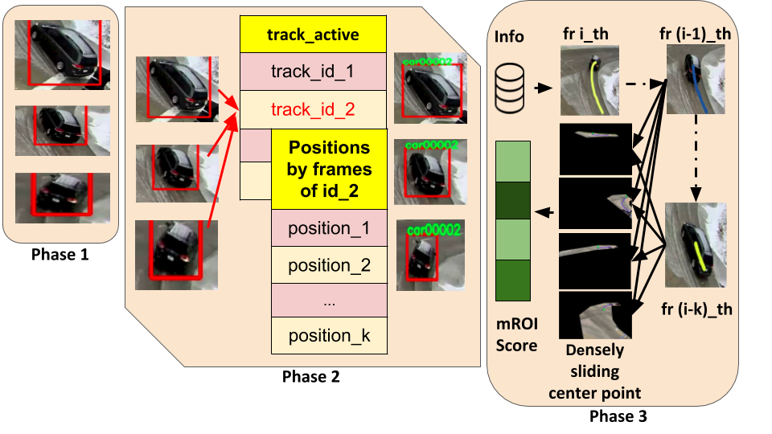
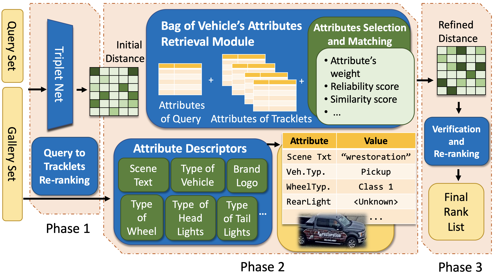
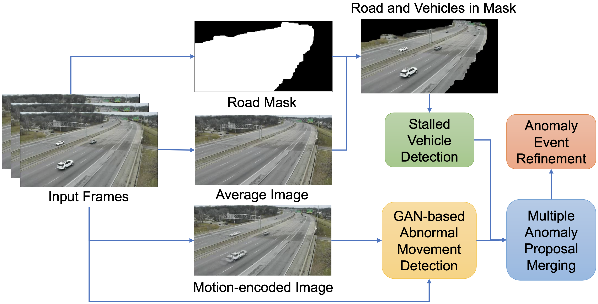

# iTASK - Intelligent Traffic Analysis Software Kit
CVPR AI City Challenge 2020 (HCMUS Team)

## Introduction

Our Intelligent Traffic Analysis Software Kit (iTASK) aims to tackle three challenging problems: vehicle flow counting, vehicle re-identification, and abnormal event detection. Experiments on the datasets of traffic flow analysis from AI City Challenge 2020 show our competitive results.

## Vehicle Flow Counting

We propose to real-time track vehicles moving along the desired direction in corresponding motion-of-interests (MOIs). Our proposed method achieved S1 score of 0.8297 for vehicle flow counting in Track 1.



## Vehicle Re-identification

We consider each vehicle as a document with multiple semantic words (i.e., vehicle attributes) and transform the given problem to classical document retrieval. Our proposed method achieved mAP score of 0.3882 for vehicle re-identification in Track 2.



## Abnormal Event Detection

We propose to forward and backward refine anomaly detection using GAN-based future prediction and backward tracking completely stalled vehicle or sudden-change direction, respectively. Our proposed method achieved S4 score of 0.9059 for anomaly detection in Track 4.



## Citations
Please consider citing this project in your publications if it helps your research:

```
@Inproceedings{tmtriet-AICity2020,
  Title          = {iTASK - Intelligent Traffic Analysis Software Kit},
  Author         = {Minh-Triet Tran and Tam V. Nguyen and Trung-Hieu Hoang and Trung-Nghia Le and Khac-Tuan Nguyen and Dat-Thanh Dinh and Thanh-An Nguyen and Hai-Dang Nguyen and Trong-Tung Nguyen and Xuan-Nhat Hoang and Viet-Khoa Vo-Ho and Trong-Le Do and Lam Nguyen and Minh-Quan Le and Hoang-Phuc Nguyen-Dinh and Trong-Thang Pham and Xuan-Vy Nguyen and E-Ro Nguyen and Quoc-Cuong Tran and Hung Tran and Hieu Dao and Mai-Khiem Tran and Quang-Thuc Nguyen and The-Anh Vu-Le and Tien-Phat Nguyen and Gia-Han Diep and Minh N. Do},
  BookTitle      = {The IEEE Conference on Computer Vision and Pattern Recognition (CVPR) Workshops},
  Year           = {2020},
}
```

------------------
The code is used for academic purpose only.
