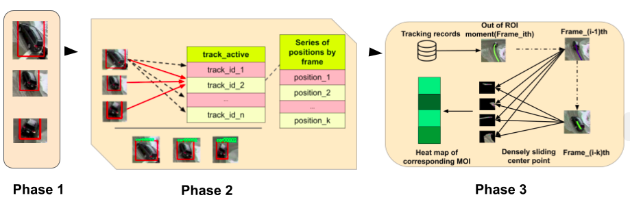

# AIC20 Track 1:Vehicle Counts by Class at Multiple Intersections
## Overview 

Our implementation comprised of: 

1/ Detected bounding box based on dla-centernet architecture

2/ Tracking car moving based on IoU overlapping

3/ Counting car based on densly sliding object through MOI region



## Usage 

### Reproduce tracking

```
cd AIC20

python test_iou.py
```

### Reproduce counting

```
cd AIC20/car_counter

python counter.py
```


